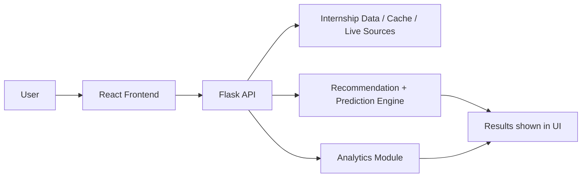

# Internship Prediction & Recommendation System

This project is a full-stack internship discovery platform that combines a React frontend, a Flask backend, and machine learning components. It helps users explore internships, predict demand, receive recommendations, and analyze internship data.

## Overview

The application is designed for students and job seekers who want a smarter way to discover internships. It provides:

- a modern dashboard for browsing internships
- a Flask API for predictions and recommendations
- analytics over internship listings and trends
- optional resume parsing and matching features

## Key Features

- Frontend built with React, TypeScript, and Vite
- Backend built with Flask and Python
- Internship browsing with filtering by domain, city, source, and search text
- Prediction API for internship demand scoring
- Recommendation engine for personalized internship results
- Analytics endpoints for summary statistics
- Live data fetching support and cached datasets
- Docker support for container-based deployment

## Tech Stack

### Frontend
- React 19
- TypeScript
- Vite
- Tailwind-compatible styling setup

### Backend
- Python 3.10+
- Flask
- Flask-CORS
- Pandas, NumPy, Scikit-learn
- XGBoost
- Streamlit (optional dashboard)

### Data & ML
- Internship data generation and caching
- Model training and evaluation utilities
- Preprocessing and feature engineering pipelines
- Resume parsing and skill matching

## Project Structure

```text
.
├── src/
│   ├── App.tsx
│   ├── components/
│   ├── pages/
│   └── python/
│       ├── app.py
│       ├── flask_app.py
│       ├── internship_data.py
│       ├── live_data_fetcher.py
│       ├── ml_models.py
│       ├── model_training.py
│       ├── preprocessing.py
│       ├── resume_parser.py
│       ├── streamlit_app.py
│       ├── requirements.txt
│       └── exports/ , live_data/ , model_output/ , preprocessing_output/
├── scripts/
│   ├── start-dev.ps1
│   └── stop-dev.ps1
├── docker-compose.yml
├── Dockerfile.frontend
├── package.json
└── README.md
```

## Prerequisites

Make sure the following are installed:

- Node.js 18+ and npm
- Python 3.10+ 
- Windows PowerShell (recommended for the provided scripts)
- Docker (optional, for containerized deployment)

## Setup Instructions

### 1. Clone the repository

```powershell
git clone <repo-url>
cd internship-prediction-recommendation-system
```

### 2. Install frontend dependencies

```powershell
npm install
```

### 3. Create and activate a Python virtual environment

```powershell
python -m venv .venv
Set-ExecutionPolicy -Scope Process -ExecutionPolicy RemoteSigned
.\.venv\Scripts\Activate.ps1
```

### 4. Install Python dependencies

```powershell
python -m pip install --upgrade pip
python -m pip install -r src/python/requirements.txt
```

### 5. Optional environment variables

The app can run without additional secrets for the default local dataset, but you may optionally set:

- `FLASK_RUN_HOST`
- `FLASK_RUN_PORT`

Example:

```powershell
$env:FLASK_RUN_HOST = "0.0.0.0"
$env:FLASK_RUN_PORT = "5000"
```

## Running the Project Locally

### Quick start (recommended on Windows)

From the repository root, run:

```powershell
powershell -ExecutionPolicy Bypass -File .\scripts\start-dev.ps1
```

This will start:

- Backend API at http://127.0.0.1:5000/
- Frontend at http://127.0.0.1:5173/

### Stop the local services

```powershell
powershell -ExecutionPolicy Bypass -File .\scripts\stop-dev.ps1
```

### Manual start

#### Start the frontend

```powershell
npm run dev -- --host 0.0.0.0 --port 5173
```

#### Start the backend

```powershell
$env:FLASK_RUN_HOST = "0.0.0.0"
$env:FLASK_RUN_PORT = "5000"
python src/python/flask_app.py
```

#### Optional: launch Streamlit

```powershell
streamlit run src/python/streamlit_app.py
```

## Screenshots

You can add screenshots of the following views to make the project easier to understand:

- home page
- internship exploration page
- recommendation page
- prediction page
- analytics dashboard

Example placeholder:

```text


```

If you want, you can add the actual images under a docs/screenshots folder and update the paths accordingly.

## How to Use the App

### 1. Open the frontend

After starting the services, open:

- http://127.0.0.1:5173/

### 2. Browse internships

Use the Explore page to:
- search internship titles or skills
- filter by domain, city, or source
- view internship details and available metadata

### 3. Get recommendations

Go to the Recommendation page and provide your profile details such as:
- skills
- interests
- preferred location
- minimum stipend

The system will rank internships that best match your profile.

### 4. Use the prediction feature

On the Prediction page, enter internship-related input values to see a demand score and the factors influencing the result.

### 5. Review analytics

Open the Dashboard or Analytics view to understand:
- total internship count
- live versus generated listings
- top domains and skills
- general trends in the dataset

### 6. Manage applied internships

Use the applied/internship tracking flow to save and review internships you have already applied to.

## API Endpoints

The Flask backend exposes the following endpoints:

- `GET /` — health/status overview
- `GET /api/internships` — list internships with pagination and filters
- `POST /api/predict` — predict a demand score for a given internship payload
- `POST /api/recommend` — generate internship recommendations for a student profile
- `GET /api/analytics` — summarized analytics data
- `POST /api/resume/parse` — parse a resume text payload
- `POST /api/resume/search` — search internships based on parsed resume data
- `GET /api/domains` — list available domains
- `GET /api/cities` — list available cities
- `GET /api/skills` — list available skills
- `GET /api/applied` and `POST /api/applied` — manage applied internship IDs
- `GET /api/sources` — show internship source counts
- `GET /api/live/fetch` — fetch live internships from external sources
- `GET /api/live/status` — report live-data status

## Data Sources and Generated Artifacts

The project includes support for:

- Generated internship data
- Cached live data from integrated sources
- Preprocessed training datasets
- Model output and reports

Typical artifact folders include:

- `src/python/live_data/`
- `src/python/model_output/`
- `src/python/preprocessing_output/`
- `src/python/exports/`

## Docker Deployment

The repository includes Docker configuration for container-based deployment.

### Build and run with Docker Compose

```powershell
docker compose up --build
```

This will build the frontend and backend containers defined in `docker-compose.yml`.

### Access points after Docker deployment

- Frontend: http://localhost:3000/
- Backend: http://localhost:5000/

## Make It Permanent on Windows

If you want the app to start automatically whenever you sign in to Windows:

1. Open the Startup folder:

```text
%AppData%\Microsoft\Windows\Start Menu\Programs\Startup
```

2. Create a shortcut to:

```powershell
powershell.exe -ExecutionPolicy Bypass -File "C:\Users\sunil\Downloads\internship-prediction-recommendation-system\scripts\start-dev.ps1"
```

3. Restart Windows or sign out and sign back in.

Then open:

- http://127.0.0.1:5173/

## Troubleshooting

### Frontend issues
- Run `npm install` again if the dev server fails to start.
- Ensure you are using a supported Node version.

### Backend issues
- Make sure the virtual environment is activated.
- Reinstall Python packages with `python -m pip install -r src/python/requirements.txt`.
- Confirm the Flask host and port are set correctly.

### PowerShell permission issues
- If execution is blocked, run:

```powershell
Set-ExecutionPolicy -Scope Process -ExecutionPolicy RemoteSigned
```

### Port conflicts
- If 5000 or 5173 is already in use, stop the conflicting process or change the port.

## How It Works

The system follows a simple end-to-end architecture:

1. Data layer
   - Internship data is generated or loaded from cached/live sources.
   - The backend prepares this data for filtering, analytics, and recommendation tasks.

2. Backend services
   - Flask exposes REST endpoints for internships, predictions, recommendations, analytics, and resume parsing.
   - These services process requests and return JSON responses to the frontend.

3. Frontend experience
   - React and TypeScript render the UI for browsing internships and interacting with the app.
   - The frontend calls the backend API to load data and display results.

4. Machine learning flow
   - The recommendation engine ranks internships based on student preferences.
   - The prediction engine estimates demand scores for internships.
   - Other modules support preprocessing, training, and analytics.

5. Deployment modes
   - Local development uses Vite + Flask directly.
   - Docker Compose provides a container-based deployment option for a more production-like setup.

### Architecture Diagram



## Development Notes

You can use the project in two main modes:

- Local development mode for active coding and testing
- Docker mode for a more production-like deployment experience

For local development, the scripts in `scripts/` are the simplest way to launch the app reliably.

## Contributing

1. Fork the repository
2. Create a feature branch
3. Make your changes
4. Run the relevant checks and tests
5. Submit a pull request

## Contact

Maintainer: Sunil

If you want, I can also help you add:
- a one-click startup script for Linux/macOS
- a production-grade Nginx reverse proxy setup
- a deployment guide for Azure, Render, or Railway

