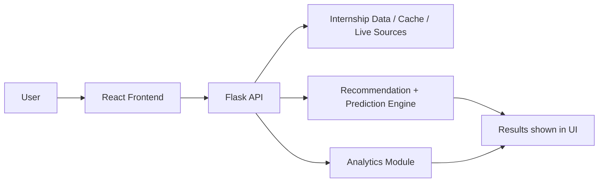

# Internship Prediction & Recommendation System

A full-stack internship discovery platform built with React, TypeScript, Vite, Flask, and Python. It helps users browse internships, predict demand, receive recommendations, and track applied opportunities.

## Overview

This project is designed for students and job seekers who want a smarter way to discover internships. It includes:

- a modern dashboard for browsing 30,000+ internship listings
- a Flask API for predictions and recommendations
- analytics over internship listings and trends
- persistent application tracking with local and server-backed storage
- optional resume parsing and matching features

## Key Features

- Browse internships with filters for domain, city, source, and search text
- Predict internship demand using a trained ML model
- Get personalized internship recommendations based on student profile
- Save and manage applied internships from the UI
- Export applied internships as CSV
- Support live data fetching and cached datasets

## Tech Stack

### Frontend
- React 19
- TypeScript
- Vite
- Tailwind-compatible styling

### Backend
- Python 3.10+
- Flask
- Flask-CORS
- Pandas, NumPy, Scikit-learn
- XGBoost
- Streamlit (optional dashboard)

## Project Structure

```text
.
├── src/
│   ├── App.tsx
│   ├── components/
│   ├── pages/
│   └── python/
│       ├── app.py
│       ├── flask_app.py
│       ├── internship_data.py
│       ├── live_data_fetcher.py
│       ├── ml_models.py
│       ├── model_training.py
│       ├── preprocessing.py
│       ├── resume_parser.py
│       ├── streamlit_app.py
│       ├── requirements.txt
│       └── exports/ , live_data/ , model_output/ , preprocessing_output/
├── scripts/
│   ├── start-dev.ps1
│   └── stop-dev.ps1
├── .github/workflows/deploy.yml
├── docker-compose.yml
├── Dockerfile.frontend
├── package.json
└── README.md
```

## Prerequisites

Make sure the following are installed:

- Node.js 18+ and npm
- Python 3.10+
- Windows PowerShell (recommended for the provided scripts)
- Docker (optional)

## Setup Instructions

### 1. Clone the repository

```powershell
git clone <repo-url>
cd internship-prediction-recommendation-system
```

### 2. Install frontend dependencies

```powershell
npm install
```

### 3. Create and activate a Python virtual environment

```powershell
python -m venv .venv
Set-ExecutionPolicy -Scope Process -ExecutionPolicy RemoteSigned
.\.venv\Scripts\Activate.ps1
```

### 4. Install Python dependencies

```powershell
python -m pip install --upgrade pip
python -m pip install -r src/python/requirements.txt
```

## Running Locally

### Quick Start

Start the backend in one terminal:

```powershell
$env:FLASK_RUN_HOST = "0.0.0.0"
$env:FLASK_RUN_PORT = "5000"
python src/python/flask_app.py
```

Start the frontend in another terminal:

```powershell
npm run dev -- --host 0.0.0.0 --port 5173
```

Open the app at:

- http://localhost:5173
- Backend API: http://localhost:5000

### PowerShell helper scripts

From the repository root:

```powershell
powershell -ExecutionPolicy Bypass -File .\scripts\start-dev.ps1
```

To stop the services:

```powershell
powershell -ExecutionPolicy Bypass -File .\scripts\stop-dev.ps1
```

## Running Frontend with Permanent Background Server

For a **permanent local URL that stays active** without needing a terminal open:

### One-Time Setup

```powershell
# 1. Install PM2 globally
npm install -g pm2

# 2. Build the frontend for production
npm run build

# 3. Install server dependencies
npm install express compression

# 4. Start the server permanently in background
pm2 start server.js --name "internship-app"

# 5. Save the PM2 process list
pm2 save
```

### Access Your App

Your app is now available at: **http://localhost:8000**

The server runs **permanently in the background** and will continue running even after you close all terminals and VS Code.

### Restarting or Managing the Server

```powershell
# Check server status
pm2 status

# Restart server after making code changes
pm2 restart internship-app

# Stop the server
pm2 stop internship-app

# Start the saved processes
pm2 resurrect

# View server logs
pm2 logs internship-app
```

### One-Click Startup (Next Time)

Double-click: `start-background-server.bat`

### Update Workflow

1. Edit your code in VS Code
2. Run: `npm run build`
3. Server automatically picks up changes
4. Refresh browser at **http://localhost:8000**

---

## Deploying to GitHub Pages

The frontend is configured for GitHub Pages deployment.

### Deploy automatically

Push the repository to GitHub and enable GitHub Actions in the repository settings:

1. Go to Settings → Pages
2. Choose GitHub Actions as the source
3. Push to the main branch
4. Wait for the workflow in .github/workflows/deploy.yml to complete

Your site will be available at:

```text
https://<your-github-username>.github.io/internship-prediction-recommendation-system/
```

> Note: GitHub Pages hosts the frontend only. The Flask backend remains local unless you deploy it separately to a service such as Render, Railway, or Fly.io.

## Optional: Run the Streamlit Dashboard

```powershell
streamlit run src/python/streamlit_app.py --server.port 8501
```

## How to Use the App

1. Open the frontend at http://localhost:npm
5173
2. Browse internships on the Explore page
3. Use the Recommendation page to get tailored suggestions
4. Use the Prediction page to estimate internship demand
5. Save internships from the Explore or Applied pages
6. Export your applied internships as CSV


### 6. Review Analytics

Open the **Dashboard** to understand:
- Total internship count (30,000+)
- Live versus generated listings
- Top domains and skills
- Stipend ranges
- General trends in the dataset
- Monthly trends and growth forecasts

### 7. Resume-Based Search

Use the **Resume Search** page to:
- Upload or paste your resume
- Extract skills automatically
- Get ranked internship matches based on resume content

## API Endpoints

The Flask backend exposes the following endpoints:

### Core Internship Endpoints
- `GET /api/internships` — list internships with pagination, filters, search
- `GET /api/domains` — list available domains
- `GET /api/cities` — list available cities
- `GET /api/skills` — list available skills
- `GET /api/sources` — show internship source counts

### Predictions & Recommendations
- `POST /api/predict` — predict a demand score for a given internship payload
- `POST /api/recommend` — generate personalized internship recommendations

### Applied Applications (NEW)
- `GET /api/applied` — fetch all applied application IDs
- `POST /api/applied` — add or remove an application
  ```json
  { "id": <int>, "action": "add"|"remove" }
  ```

### Analytics & Data
- `GET /api/analytics` — summarized analytics data
- `GET /api/sources` — internship source distribution

### Resume Processing
- `POST /api/resume/parse` — parse a resume text payload
- `POST /api/resume/search` — search internships based on parsed resume data

### Live Data
- `GET /api/live/fetch` — fetch live internships from external sources
- `GET /api/live/status` — report live-data status

### System
- `GET /` — health/status overview

## Data Sources and Persistence

### Live Data & Caching
The project includes support for:
- Cached live data from integrated sources (Indeed, Internshala, Adzuna, GitHub Jobs, RemoteOK)
- 226 live listings cached locally
- 29,774 generated internships for diversity
- **Total: 30,000+ internships**

### Applied Applications Storage
- **File:** `src/python/applied_applications.json`
- **Format:** JSON array of internship IDs
- **Lifecycle:** Server-side persistent storage that survives app restarts

### Data Artifacts
Typical artifact folders include:
- `src/python/live_data/` — cached live job listings
- `src/python/model_output/` — trained models and feature importance
- `src/python/preprocessing_output/` — processed datasets and features
- `src/python/exports/` — CSV and JSON exports

## Docker Deployment

The repository includes Docker configuration for container-based deployment.

### Build and run with Docker Compose

```powershell
docker compose build
docker compose up
```

This will build the frontend and backend containers defined in `docker-compose.yml`.

### Access points after Docker deployment

- Frontend: http://localhost:3000/ (Nginx)
- Backend: http://localhost:5000/ (Flask)

### Docker Services
- **Backend** (`src/python/Dockerfile`): Flask API on port 5000
- **Frontend** (`Dockerfile.frontend`): Nginx on port 80 (mapped to 3000)

## Make It Permanent on Windows

If you want the app to start automatically whenever you sign in to Windows:

1. Open the Startup folder:

```text
%AppData%\Microsoft\Windows\Start Menu\Programs\Startup
```

2. Create a shortcut to:

```powershell
powershell.exe -ExecutionPolicy Bypass -File "C:\Users\sunil\Downloads\internship-prediction-recommendation-system\scripts\start-dev.ps1"
```

3. Restart Windows or sign out and sign back in.

Then open:

- http://127.0.0.1:5173/

## Troubleshooting

### Frontend issues
- Run `npm install` again if the dev server fails to start.
- Ensure you are using a supported Node version.

### Backend issues
- Make sure the virtual environment is activated.
- Reinstall Python packages with `python -m pip install -r src/python/requirements.txt`.
- Confirm the Flask host and port are set correctly.

### PowerShell permission issues
- If execution is blocked, run:

```powershell
Set-ExecutionPolicy -Scope Process -ExecutionPolicy RemoteSigned
```

### Port conflicts
- If 5000 or 5173 is already in use, stop the conflicting process or change the port.

## How It Works

The system follows a simple end-to-end architecture:

1. Data layer
   - Internship data is generated or loaded from cached/live sources.
   - The backend prepares this data for filtering, analytics, and recommendation tasks.

2. Backend services
   - Flask exposes REST endpoints for internships, predictions, recommendations, analytics, and resume parsing.
   - These services process requests and return JSON responses to the frontend.

3. Frontend experience
   - React and TypeScript render the UI for browsing internships and interacting with the app.
   - The frontend calls the backend API to load data and display results.

4. Machine learning flow
   - The recommendation engine ranks internships based on student preferences.
   - The prediction engine estimates demand scores for internships.
   - Other modules support preprocessing, training, and analytics.

5. Deployment modes
   - Local development uses Vite + Flask directly.
   - Docker Compose provides a container-based deployment option for a more production-like setup.

### Architecture Diagram



## Development Notes

You can use the project in two main modes:

- Local development mode for active coding and testing
- Docker mode for a more production-like deployment experience

For local development, the scripts in `scripts/` are the simplest way to launch the app reliably.

## Contributing

1. Fork the repository
2. Create a feature branch
3. Make your changes
4. Run the relevant checks and tests
5. Submit a pull request

## Contact

Maintainer: Sunil

If you want, I can also help you add:
- a one-click startup script for Linux/macOS
- a production-grade Nginx reverse proxy setup
- a deployment guide for Azure, Render, or Railway

